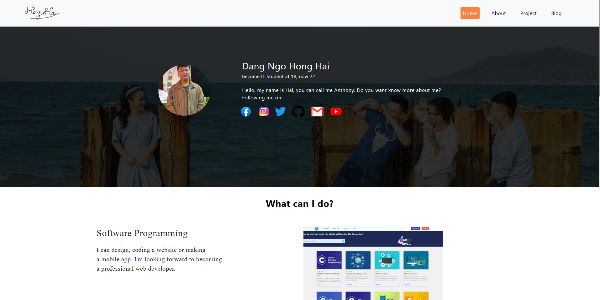

# Anthony Hai Official - My portfolio website

## Introduction

Hello everybody, I'm Hai and this is my portfolio website, the place you can know everything about me and my works:

    

## Motivation

I made this when I was a college student. I want to share everything about me and also have a place where I can see my work. I made this myself from design and coding it. With this portfolio, I have learned many things about programming and want to be a full-stack developer in the future.

## Thank you

In my project, I used some images with my friends. I am appreciated if you allow me to use them. 

## Announcement

The next version of my portfolio will be available soon!
